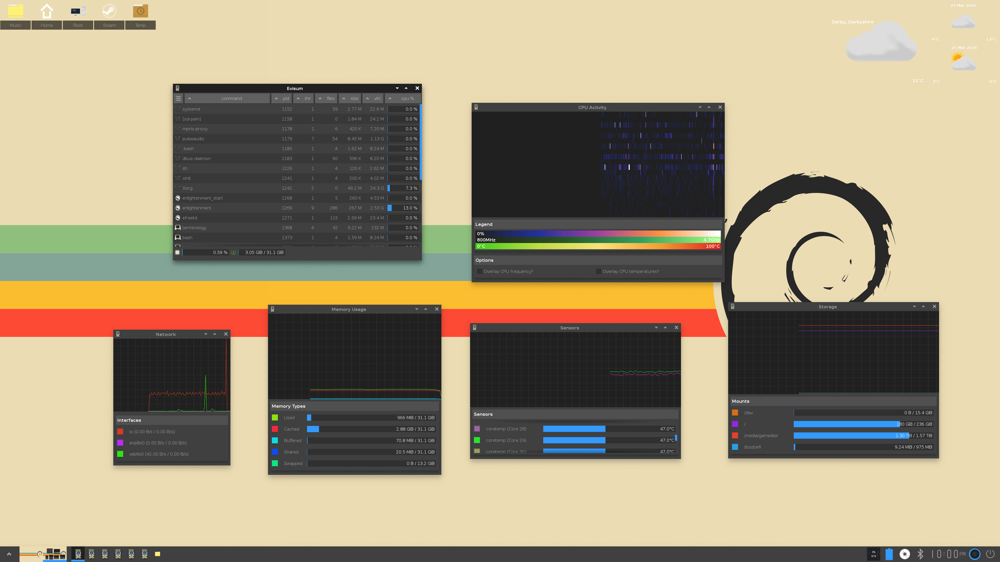

# Evisum - An Enlightened System Monitor

I sincerely hope you can enjoy this application. It's fairly comprehensive and very
portable. The user interface is designed with my personal preferences in mind.
Having gotten into computer science in the early 90s there is a nostalgic feel to
the program and also some homage is paid to EFL and Enlightenment.

It does not rely on any third-party libraries outside of EFL which was quite some undertaking.

I'd like to express that schizophrenia doesn't exclude anyone from following
their dreams as long as you hold onto a touch of realism and your expectations 
aren't too high.



## 📚 Table of Contents
- [🔥 Features](#-features)
- [📌 Requirements](#-requirements)
- [⚙️ Build Instructions](#%EF%B8%8F-build-instructions)
- [🚀 Installation](#-installation)
- [🎯 Usage Examples](#-usage-examples)
- [🤝 Contributions](#-contributions)

## 🔥 Features
- Cross-platform support for **Linux, FreeBSD, OpenBSD, macOS and DragonFlyBSD**.
- A **server-client** architecture for efficient system monitoring.
- Tools to monitor:
  - **Processes** 🛠️
  - **CPU usage** ⚡
  - **Memory consumption** 🧠
  - **Network activity** 🌐
  - **Storage health** 💾
  - **System sensors** 🌡️
- Designed for **speed, reliability, and usability**.

## 📌 Requirements
Evisum requires an installation of **EFL (v1.27.0+)**.

Example EFL development package installs:

### Debian / Ubuntu
```sh
sudo apt update
sudo apt install efl-all-dev
```

### Fedora
```sh
sudo dnf install efl-devel
```

Build tools are also required:
```sh
sudo apt install meson ninja-build pkg-config
# or on Fedora:
sudo dnf install meson ninja-build pkgconf-pkg-config
```

Ensure your `PKG_CONFIG_PATH` environment variable is set correctly if EFL is installed in a custom location (e.g., `/opt`):

```sh
export PKG_CONFIG_PATH="$PKG_CONFIG_PATH:/opt/libdata/pkgconfig"
```

## ⚙️ Build Instructions

Compile Evisum using `meson` and `ninja`:

```sh
meson setup build
ninja -C build
```

## 🚀 Installation

Once built, install Evisum with:

```sh
ninja -C build install
```

## 🎯 Usage Examples

### Open the process view:
```sh
evisum
```

### Inspect a specific process:
```sh
evisum <pid>
```

### Open the CPU monitor:
```sh
evisum -c
```

### Other command-line flags:
```sh
evisum -m      # memory view
evisum -d      # storage view
evisum -n      # network view
evisum -s      # sensors view
```

For additional options, use:
```sh
evisum --help
```

## 🤝 Contributions
We welcome contributions! Bug fixes and patches are greatly appreciated. However, if you want to introduce a substantial new feature, **please ensure it functions reliably on Linux, OpenBSD, and FreeBSD** before submitting a patch.
